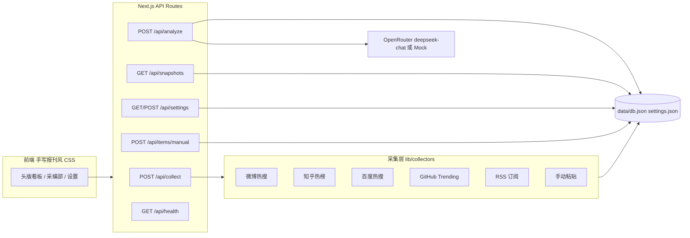

# 《热点观察哨》实施方案（存档）

> 存档日期：2026-09-08
> 关联文档：[需求说明.md](./需求说明.md)、[openrouter-接入备忘.md](./openrouter-接入备忘.md)
> 环境基线：Windows 10（PowerShell）、Node v24.14.1、npm 11.12.1（已实测确认）

---

## 1. 技术选型

| 层 | 选择 | 理由 |
|---|---|---|
| 框架 | Next.js（App Router）+ TypeScript，端口 3000 | 前端与 API Routes 一体，Windows 友好 |
| 数据层 | JSON 文件存储：`data/db.json` + `data/settings.json`，临时文件 + rename 原子写入 | 零原生依赖，避免 Windows 下 node-gyp 编译问题 |
| 采集 | 内置 `fetch` + `cheerio`（HTML 解析）+ `rss-parser`（RSS） | 服务端抓取无 CORS 限制 |
| AI | OpenAI SDK 指向 OpenRouter（详见接入备忘） | OpenRouter 官方兼容 OpenAI SDK，改动小、稳定 |
| UI | 纯手写 CSS 设计系统（复古报刊风） | 保证视觉独特性，不用现成 UI 框架 |

## 2. 架构总览



## 3. 核心数据模型（`lib/types.ts`）

```ts
type RawItem = { id: string; sourceId: string; sourceName: string;
  title: string; text?: string; url?: string; heat?: number;
  extra?: string; fetchedAt: number };

type Hotspot = { id: string; rank: number; title: string; summary: string;
  category: '社会'|'科技'|'财经'|'娱乐'|'体育'|'国际'|'健康'|'其他';
  heat: number; entities: string[]; sentiment: '正'|'中'|'负';
  itemIds: string[]; trend?: 'new'|'up'|'down'|'flat'; delta?: number };

type Snapshot = { id: string; issue: number; createdAt: number; model: string;
  mock: boolean; sources: { id: string; ok: boolean; count: number; error?: string }[];
  hotspots: Hotspot[] };
```

趋势对比：与上一期按标题归一化（去空格/标点 + 包含匹配）配对计算 `trend/delta`。

## 4. API 设计

| 方法与路径 | 功能 |
|---|---|
| `POST /api/collect` | 触发一次全量采集（榜单 + 已启用 RSS），逐源落库，返回各源成败统计 |
| `POST /api/items/manual` | 手动粘贴内容入库（作为 RawItem） |
| `POST /api/analyze` | 取最近原始条目 → AI（或 Mock）→ 生成新一期快照（含趋势对比） |
| `GET /api/snapshots?limit=` | 快照列表；`GET /api/snapshots/[id]` 快照详情 |
| `GET/POST /api/settings` | 读取/保存设置：OpenRouter Key、模型、Mock 开关、RSS 源管理 |
| `GET /api/health` | 健康检查（供 Agent Skill 使用） |

## 5. AI 接入要点（`lib/ai.ts`，已按 2026-09 官方文档核对）

- 使用 OpenAI SDK：`new OpenAI({ baseURL: 'https://openrouter.ai/api/v1', apiKey })`，这是 OpenRouter 官方推荐的 drop-in 接法
- 归属头（可选但推荐）：`HTTP-Referer`（站点 URL）与 `X-OpenRouter-Title`（应用名）
- 结构化输出：请求带 `response_format: { type: 'json_schema', json_schema: { name, strict: true, schema } }`；模型/供应商不支持时退化为「提示词约束只输出 JSON + 健壮解析」
- 健壮解析兜底：剥 ```json 围栏 → 提取首个 `{...}` → 字段校验 → 失败降温重试 1 次，再失败报错不落库
- 输入裁剪：每条内容限长、单次最多约 120 条，控制 token
- Mock 模式：`settings.mockMode === true` 时走规则式假分析（按源 heat 聚合排序），无 Key 也能全流程演示
- 详细调用参数、headers、错误处理见 [openrouter-接入备忘.md](./openrouter-接入备忘.md)

## 6. 前端页面与视觉规范（复古报刊风）

### 页面

- `/` 头版：报头 masthead（报名 + 第 N 期 + 日期 + 数据源状态灯）→ 号外特大头条（Top1）→ 分栏热点版块 → 底部跑马灯 ticker → 「剪报详情」抽屉
- `/sources` 采编部：榜单源开关 + 立即采集、RSS 管理、手动投稿
- `/settings` 印务设置：Key、模型、Mock 开关

### 视觉规范

- 配色：纸白/米黄底 + 墨黑正文 + **红墨**（热度强调）
- 字体：标题 `Noto Serif SC / 宋体` 衬线，数据用等宽数字
- 版式：双细线分隔、分栏排版、号外特大字、铅字风格趋势标签（新上榜 / ↑↑ / ↓ / 持平）
- 质感：纸张纹理 + halftone 点阵背景；纯手写 CSS，不依赖 UI 框架

## 7. 实施步骤（分阶段）

### 阶段一：网页版（当前阶段）

| # | 任务 | 产出 |
|---|---|---|
| 1 | 项目骨架：`package.json`、`tsconfig`、目录结构；依赖 `next` `react` `cheerio` `rss-parser` `openai` | 可运行的空应用 |
| 2 | 数据层：`lib/store.ts`（JSON 原子写）、`lib/types.ts` | 本地持久化 |
| 3 | 采集层：`lib/collectors/*`（微博、知乎、百度、GitHub、RSS）+ `/api/collect` + `/api/items/manual` | 多源采集，单源失败隔离 |
| 4 | AI 层：`lib/ai.ts`（OpenRouter + Mock）+ `/api/analyze` + 快照趋势对比 | 热点识别全链路（Mock 先跑通） |
| 5 | 其余 API：`/api/snapshots`、`/api/settings`、`/api/health` | 接口完备 |
| 6 | 前端三页 + 报刊风 CSS 设计系统 | 完整可视界面 |
| 7 | 测试：PowerShell 接口冒烟 + 浏览器端到端（采集→分析→看板→详情→设置），修复问题 | 可验收 |
| 8 | **用户验收（检查点 1）** | 网页版定稿 |

### 阶段二：Agent Skill（网页版验收通过后）

| # | 任务 | 产出 |
|---|---|---|
| 1 | `scripts/hotspot-scan.mjs`：调本地 API 采集+分析，输出 Markdown 报告 | CLI 工具 |
| 2 | `.cursor/skills/hotspot-monitor/SKILL.md`（frontmatter：`name`、`description`，触发词：热点/热搜/趋势；正文指导：健康检查 → 必要时启动 dev server → 执行扫描 → 汇报简报） | 可被 Agent 调用 |
| 3 | 实测：在 Cursor 对话中问「现在有什么热点」，验证 Skill 触发 | 验证记录 |
| 4 | **最终验收（检查点 2）**：README、使用说明（填 Key 关闭 Mock 的切换指引） | 项目收尾 |

## 8. 测试与验收方案

1. **接口冒烟**：PowerShell `Invoke-RestMethod` 逐个调用 API（含单源失败隔离、Mock 分析、快照对比、设置读写）
2. **浏览器端到端**：浏览器自动化走通 采集 → 分析 → 头版渲染 → 详情抽屉 → 设置保存，逐步截图核对
3. **Mock 优先**：无 Key 状态下全流程可演示；用户提供 Key 后关闭 Mock 做一次真实 AI 验证
4. **两个验收检查点**：网页版验收（检查点 1）→ Agent Skill 验收（检查点 2）

## 9. 目录结构（规划）

```text
hotspot monitor/
├── app/                    # Next.js App Router
│   ├── page.tsx            # 头版看板
│   ├── sources/page.tsx    # 采编部
│   ├── settings/page.tsx   # 印务设置
│   ├── api/                # API Routes（collect/analyze/snapshots/settings/health/items）
│   └── globals.css         # 报刊风设计系统
├── lib/
│   ├── store.ts            # JSON 原子写存储
│   ├── types.ts            # 核心类型
│   ├── ai.ts               # OpenRouter / Mock 分析
│   └── collectors/         # 微博/知乎/百度/GitHub/RSS 采集器
├── data/                   # db.json / settings.json（运行时生成）
├── scripts/hotspot-scan.mjs  # Agent Skill 用的 CLI
├── .cursor/skills/hotspot-monitor/SKILL.md
├── docs/                   # 本存档目录
└── README.md               # 收尾时补
```
